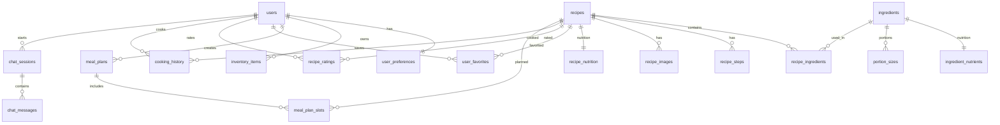

# Cookest Database Schema

This document summarizes the logical schema used by the Cookest backend and includes an ER diagram for quick visualization.

## 1. Entity groups

### Identity & preferences

- `users`
- `user_preferences`

### Ingredients & nutrition

- `ingredients`
- `ingredient_nutrients`
- `portion_sizes`

### Recipes

- `recipes`
- `recipe_ingredients`
- `recipe_steps`
- `recipe_images`
- `recipe_nutrition`

### User interactions

- `user_favorites`
- `recipe_ratings`
- `cooking_history`

### Planning & inventory

- `inventory_items`
- `meal_plans`
- `meal_plan_slots`

### AI chat

- `chat_sessions`
- `chat_messages`

## 2. ER diagram (Mermaid)

## 3. Practical relationship notes

- `recipe_ingredients` bridges recipes and ingredients and stores quantity/unit semantics.
- `meal_plan_slots` ties weekly plans to specific recipes and completion state.
- `chat_sessions` and `chat_messages` are user-scoped, enabling conversational history.
- User preference vectors (`user_preferences`) support recommendation/personalization logic.

## 4. Source of truth

The migration SQL in `src/main.rs` is the executable schema source at runtime.
