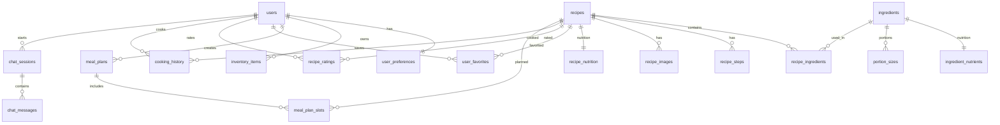

# Cookest — Schema da Base de Dados

Este documento resume o schema lógico usado pelo backend Cookest e inclui um diagrama ER para visualização rápida.

## 1. Grupos de entidades

### Identidade e preferências

- `users`
- `user_preferences`

### Ingredientes e nutrição

- `ingredients`
- `ingredient_nutrients`
- `portion_sizes`

### Receitas

- `recipes`
- `recipe_ingredients`
- `recipe_steps`
- `recipe_images`
- `recipe_nutrition`

### Interações do utilizador

- `user_favorites`
- `recipe_ratings`
- `cooking_history`

### Planeamento e inventário

- `inventory_items`
- `meal_plans`
- `meal_plan_slots`

### Chat IA

- `chat_sessions`
- `chat_messages`

## 2. Diagrama ER (Mermaid)

## 3. Notas práticas sobre relações

- `recipe_ingredients` faz a ponte entre receitas e ingredientes e guarda semântica de quantidade/unidade.
- `meal_plan_slots` liga planos semanais a receitas específicas e estado de conclusão.
- `chat_sessions` e `chat_messages` são scoped por utilizador, permitindo histórico conversacional.
- Vetores de preferência em `user_preferences` suportam lógica de personalização/recomendação.

## 4. Fonte de verdade

O SQL de migração em `src/main.rs` é a fonte executável do schema em runtime.
